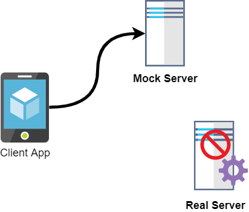

= Mock Server

//:stylesheet: asciidoctor.css

:toc:

:Author:    Dipanjal Maitra
:Email:     dipanjal.maitra@brainstation-23.com
:version-label: 0.0.1

- Author : mailto:{email}[{author}]
- Version : {version-label}

//image::assets/Front-End_Mock.png[als="mock server", 600, 300]

== What is Mock Server ?
----
A mock API server or mock server imitates a real API server by providing realistic mock API responses to requests. They can be on your local machine or the public Internet. Responses can be static or dynamic, and simulate the data the real API would return, matching the schema with data types, objects, and arrays.
----

====
Here we are going to use *json-server* to Mock our APIs.

NOTE: You must have *NodeJS* and *npm* installed
====

== JSON Server
:description: Json Mock Server
:keywords: nodejs, npm, json-server, mock-server, rest-api
[abstract]
https://github.com/typicode/json-server[json-server, , window="_blank"] is a Node Module that you can use to create demo rest json webservice in less than a minute. All you need is a JSON file for sample data.

== Installation
 npm install -g json-server

== Configuration

- First you need to put your JSONArray formatted data into a file

.`click to expand mock db`
[%collapsible]
====
[source, json]
----
{
  "posts": [
    { "id": 1, "title": "json-server", "author": "typicode" }
  ],
  "comments": [
    { "id": 1, "body": "some comment", "postId": 1 }
  ],
  "profile": { "name": "typicode" }
}
----
NOTE: You must provide *JSON ARRAY* as a dataset.
====

- Good to have a configuration file

.`click to expand config`
[%collapsible]
====
[source, json]
----
{
  "port": "3080",
  "host": "172.16.229.133",
  "watch": "/home/user/remittance/stub_server/language-db.json"
}
----
NOTE: The configuration file name must be *json-server.json*, should be placed in the execution directory, or the *json-server* installed location. for CentOS 8, the location is `/usr/local/bin` but it may vary depending on OS you are using.

====

== Execution
 json-server --watch your_db.json --host your_host_address

=== Example
 json-server --watch db.json --host 172.16.229.133

== Run in Background
:description: Json Mock Server
:keywords: nodejs, npm, json-server, mock-server, rest-api
[abstract]
Well, We have successfully launched our json mock server
but now things are getting a bit tricky here.
The *json-server* will run as long as the terminal is open, because the application is running in the foreground CLI thread.
There are several ways to run an application as a background process *nohup* is one of them.
But, there are some `cons` of nohup it's hard to monitor the process status, the occupied resources, heap size and so on.
Here https://pm2.keymetrics.io/[PM2, window="_blank"] has come into the picture.

== What is PM2 ?
:description: PM2 Process Manager
:keywords: nodejs, process-manager, pm2
[abstract]
A Production level process manager for Node.js apps with a built-in load balancer.

.PM2 vs nohup
[cols="1,1,1", options="header"]
|===
^|Feature ^|PM2 ^|nohup

|Graceful/rolling restarts
^|YES
^|NO

|OS startup script support
^|YES
^|NO

|Default Process Monitor
^|YES
^|NO

|Default Load Balancer
^|YES
^|NO
|===

== PM2 Installation
----
npm install pm2 -g
----

=== Execution With PM2
[abstract]
With PM2, now we are going to run our *json-server* as a *process*

.Essential PM2 Commands
[cols="e,a"]
|===

^|Description ^|Command
|Start Json Server
|[source]
pm2 start json-server -- language-db.json

|Monitor all processes
|[source]
pm2 monit

|Stop specific process id
|[source]
pm2 stop 0

|Restart specific process id
|[source]
pm2 restart 0

|Save processes list to respawn at reboot
|[source]
pm2 save

|===

[bibliography]
== References

* [[[bb-json-server,1]]] Json Server https://github.com/typicode/json-server#table-of-contents[Official Documentation]
* [[[bb-pm2-doc,2]]] PM2 https://pm2.keymetrics.io/docs/usage/quick-start/[Official Documentation]
* [[[bb-pm2-cheat,3]]] PM2 https://devhints.io/pm2[Cheatsheet]

//|`public boolean uploadFile(MultipartFile[] file, String remoteFilePath)`
//|*file*: type is file and then select file, +
//*remotepath*: /home/azam/Desktop/abc
//
//|`public boolean downloadFile(String fileName, String localFilePath, String remoteFilePath)`
//|*fileName*: type is text. Example: abc.jpeg or abc.txt, +
//*remotepath*: /home/azam/Desktop/abc/, +
//*localpath*: C:\Users\\BS585\Desktop\Newfolder\
//
//|`public boolean downloadListOfFile(String localFilePath, String remoteFilePath)`
//|*remotepath*: /home/azam/Desktop/abc/, +
//*localpath*: C:\Users\\BS585\Desktop\Newfolder\
//
//|`public boolean deleteFile(String fileName, String remoteFilePath)`
//|*fileName*: type is text. Example: abc.jpeg or abc.txt, +
//*remotepath*: /home/azam/Desktop/abc/
//|===
//====
//[cols="1,2,3"]
//|===
//|Features |PM2 |nohup
//|F1 |YES |NO
//|===
//====

//== New
//[IMPORTANT]
//.*Configuration*
//====
//Before going to use all the method there are some rules  , such as:

//NOTE: host, port ,user, password, privatekey, passphrase must be configure in application.yml

//TIP: User can use password or ssh key to communicate with a server. To first time communicate with server through ssh key one need to install ssh in the server.

//WARNING: when one use ssk key. The key (public and private key must be in .ssh directory).Public key paste it into the server authorize_key file in the .ssh directory. And also when client try to first time connect to server with ssh key then he need to set passPharse for private key.

//.All the method and it's demo format of access url in postman api. In postman api first select body and then enter the key and value

//====

//=== *Connection method*
//
//
//_This method is used for creating sftpchannel so that user can upload or download or deleting file. First we need jsch class after that creating session from jsch object giving the username, host, port, after that a Channel connected to sftp server (as a subsystem of the ssh server)._
//
//* *@return* : after connecting the channel it should return the connect sftpchannel.
//
//.`click here to see the code`
//[%collapsible]
//====
//[,java]
//----
//     private ChannelSftp createChannelSftp() {
//        try {
//            JSch jSch = new JSch();
//            jSch.addIdentity(privatekey, passphrase.getBytes());
//            Session session = jSch.getSession(username, host, port);
//            session.setConfig("StrictHostKeyChecking", "no");
//            session.connect(sessionTimeout);
//            Channel channel = session.openChannel("sftp");
//            channel.connect(channelTimeout);
//            return (ChannelSftp) channel;
//        } catch (JSchException ex) {
//            logger.error("Create ChannelSftp error", ex);
//        }
//
//        return null;
//    }
//----
//====
//
//=== *Disconnect method*
//
//
//_This method is used for close all the connection._
//
//* *@param* : channelSftp is the channel which connect successfully in connect() method
//*.
//
//.`click here to see the code`
//[%collapsible]
//====
//[,java]
//----
//    private void disconnectChannelSftp(ChannelSftp channelSftp) {
//        try {
//            if (channelSftp == null)
//                return;
//
//            if (channelSftp.isConnected())
//                channelSftp.disconnect();
//
//            if (channelSftp.getSession() != null)
//                channelSftp.getSession().disconnect();
//
//        } catch (Exception ex) {
//            logger.error("SFTP disconnect error", ex.getMessage());
//        }
//    }
//----
//====
//=== *File Upload method*
//
//
//_This method is used for file upload file from client to server._
//
//* *@param localFilePath* :  Here localFilePath is the local directory used for a client
//who upload file from his pc or any other device
//* *@param remoteFilePath* : Here remoteFilepath is the directory of your server where you can store your file
//* *@return* : after storing your file this method, return boolean value to ensure that your file is saved or not.
//
//.`click here to see the code`
//[%collapsible]
//====
//[,java]
//----
//    public boolean uploadFile(MultipartFile[] file, String remoteFilePath) {
//        ChannelSftp channelSftp = createChannelSftp();
//
//        if (remoteDirectoryCk(remoteFilePath)) {
//            try {
//                File convFile = convertMultiPartToFile(file);
//                if (convFile.canRead()) {
//                    channelSftp.put(new FileInputStream(convFile),
//                            remoteFilePath + "/" + convFile.getName());
//                    return true;
//                }
//
//            } catch (SftpException | FileNotFoundException ex) {
//                logger.error("Error upload file", ex);
//            } catch (IOException e) {
//                logger.error("Error upload file", e);
//            } finally {
//                disconnectChannelSftp(channelSftp);
//            }
//        }
//        return false;
//    }
//----
//====
//
//=== *File Download method*
//
//_This method is used for download file from server to client._
//
//* *@param localFilePath* : localFilepath is the directory of the client path where download file should be store.
//* *@param remoteFilePath* : Here remoteFilepath is the directory of your server can access your file
//* *@return* : if it fetches data successfully then it sends true otherwise send false
//.
//
//.`click here to see the code`
//[%collapsible]
//====
//[,java]
//----
//   public boolean downloadFile(String fileName, String localFilePath, String remoteFilePath) {
//        ChannelSftp channelSftp = createChannelSftp();
//        OutputStream outputStream;
//
//        try {
//            File file = new File(localFilePath + fileName);
//            outputStream = new FileOutputStream(file);
//            channelSftp.get(remoteFilePath + fileName, outputStream);
//            file.createNewFile();
//            return true;
//        } catch (SftpException | IOException ex) {
//            logger.error("Error download file", ex.getMessage());
//        } finally {
//            disconnectChannelSftp(channelSftp);
//        }
//
//        return false;
//    }
//----
//====
//
//=== *List Of File Download method*
//
//_This method is used downloading the list of file from server directory to client directory._
//
//* *@param localFilePath* :  url of client directory where file should be stored
//* *@param remoteFilePath* : url of server directory from where list of files should fetch
//* *@return* : if it fetches all data successfully then it sends true otherwise send false.
//
//.`click here to see the code`
//[%collapsible]
//====
//[,java]
//----
//   public boolean downloadListOfFile(String localFilePath, String remoteFilePath) {
//        ChannelSftp channelSftp = createChannelSftp();
//        try {
//
//            Vector<ChannelSftp.LsEntry> fileList = channelSftp.ls(remoteFilePath);
//
//            for (ChannelSftp.LsEntry file : fileList) {
//                if (!file.getFilename().startsWith(".")) {
//                    channelSftp.get(remoteFilePath + file.getFilename(),
//                            localFilePath + file.getFilename());
//                }
//            }
//
//            return true;
//        } catch (SftpException ex) {
//            logger.error("Error downloading file list", ex.getMessage());
//        } finally {
//            disconnectChannelSftp(channelSftp);
//        }
//
//        return false;
//    }
//----
//====
//
//=== *Delete method*
//
//_This method is used for deleting file in server directory._
//
//* *@param fileName* : fileName for delete
//* *@param remoteFilePath* : server directory where the file stored
//* *@return* : if it deleted successfully then it sends true otherwise send false.
//
//.`click here to see the code`
//[%collapsible]
//====
//[,java]
//----
//
//public boolean deleteFile(String fileName, String remoteFilePath) {
//        ChannelSftp channelSftp = createChannelSftp();
//        try {
//
//            Vector fileList = channelSftp.ls(remoteFilePath);
//            for (int i = 0; i < fileList.size(); i++) {
//                ChannelSftp.LsEntry lsEntry = (ChannelSftp.LsEntry) fileList.get(i);
//                String file = lsEntry.getFilename();
//                logger.info("access file name: " + file);
//                if (file.equalsIgnoreCase(fileName)) {
//                    channelSftp.rm(remoteFilePath + fileName);
//                    return true;
//                } else {
//                    logger.info(fileName + " " + "not found");
//                }
//            }
//        } catch (SftpException ex) {
//            logger.error("Error deleting file file", ex.getMessage());
//        } finally {
//            disconnectChannelSftp(channelSftp);
//        }
//        return false;
//    }
//
//----
//====
//
//.Highlights
//****
//There are lots of library are present for sftp operation, such as: +
//`Jsch`, +
//`sshj`, +
//`apache mina`, +
//`Apache Commons VFS` +
//etc.
//
//TIP: From the above library. I choose Jsch, because of popularity, easier configuration, communication, other features which i provided in the feature section. And many other things which you can found in the jsch website.
//****
//
//== Additional Resources
//
//=== Read
//
//* Jsch. http://www.jcraft.com/jsch/[Official Website]
//
//== Watch
//
//* https://www.youtube.com/watch?v=RaaGWspGMms&t=741s[How to perform SFTP Operation Using Java, window="_blank"]
//
//[bibliography]
//== References
//
//* [[[bb-ant,1]]] Jsch. http://www.jcraft.com/jsch/[Official Website]
//* [[[bb-ant,2]]] Sftp operation docs. https://epaul.github.io/jsch-documentation/simple.javadoc/com/jcraft/jsch/JSch.html[github jsch]
